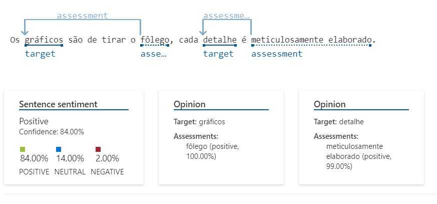
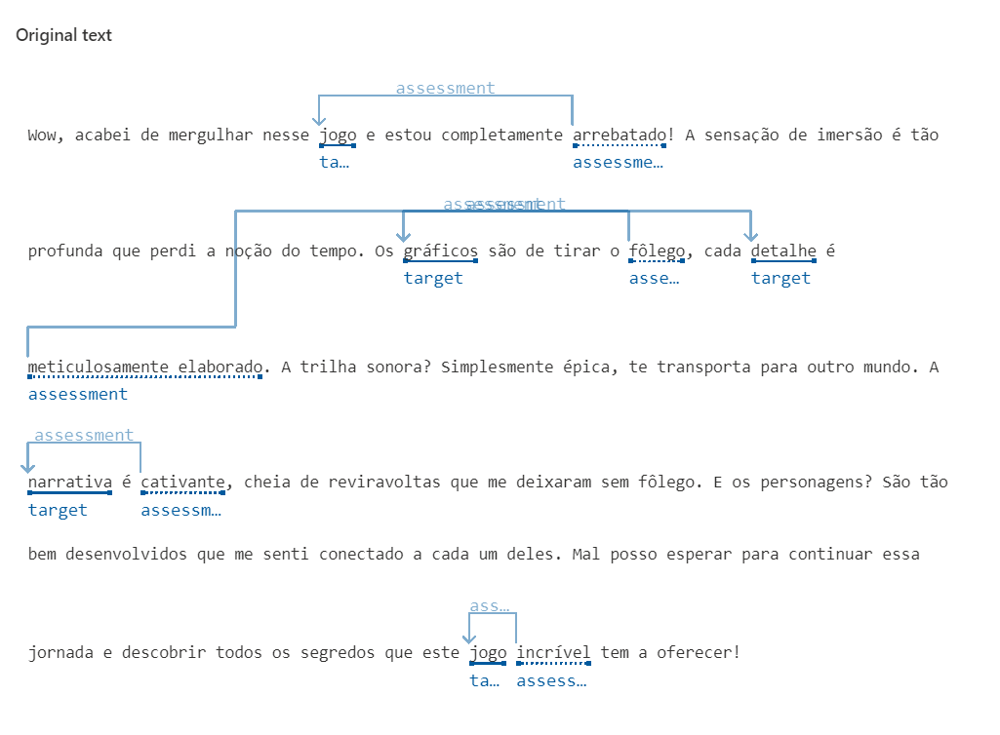
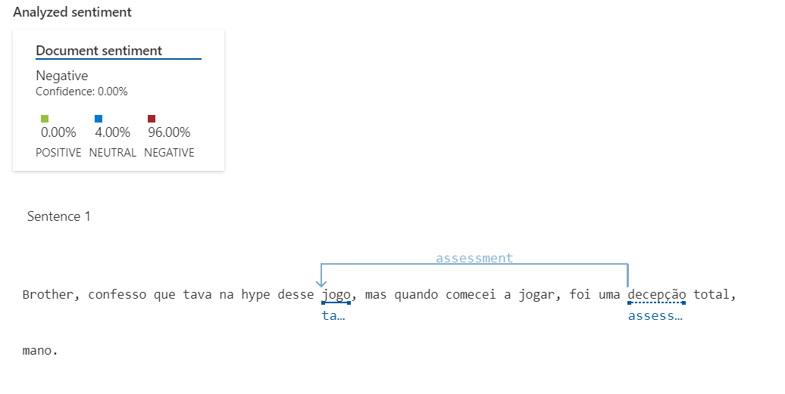
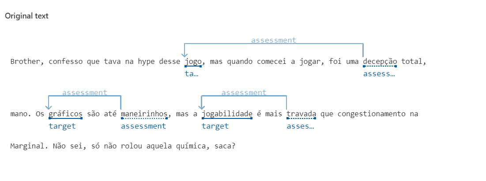
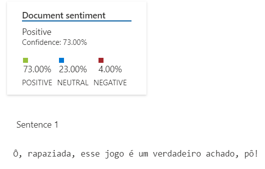
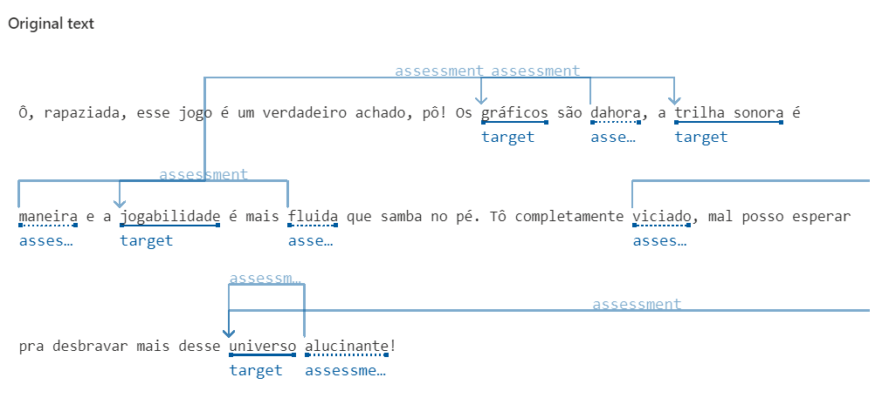

# Estúdio de fala (Speech Studio)

1- Acesse o portal <https://speech.microsoft.com/portal> e faça login
2- Acesse a engrenagem no canto superior direito
3- Criar novo recurso
4- Acesse a aba de "Conversão de fala em texto" > "Conversão de fala em texto em tempo real"
5- Faça upload do arquivo .
6- Escolher idioma do arquivo a ser transcrito e importar o arquivo de audio

# Estúdio de Linguagem (Language Studio)

O Microsoft Language Studio é um ambiente online que nos auxilia a fazer análise semantica de texto ou de fala.Pode ser usado para anlálise de sentimentos (NLP).

1- Acesse o portal <https://portal.azure.com/#home>
2- Procurar por "Criar um recurso"  e selecione o "Language Service"
3-  Preencher os campos para gerar o recurso.
4- Assim que o recurso de Langue estiver validado e criado (o serviço gratuito é válido por 30 dias), acesse <https://language.cognitive.azure.com/home> para configurar o recurso desejado
5- O último passo dessa criação é selecionar o recurso de fala criado anteriormente.
6- Com os recursos configutaos é necessário agora criar o recurso especifico para o procedimento desejado relacionado a Linguagem. Basta clicar no "Create new" > "Classify Text" > "Analyze sentiment and opinions".
7- Defina os parametros iniciais para utilziar o recurso, selecione ou digite o texto para ser analisado e clique em "RUN".

## Opinião

- É uma ferramenta com um potencial gigantesco, principalmente pela segmentação das frases com seus respectivos valores em cada sentença. O nivel de detalhe, somando à apresentação da estrutura semantica das frases, com sua devida analise sentimental entre "alvo/avaliação" é um fator muito interessante e que nos permite verificar a veracidade dos comentários em relação ao dado real.

---

## Análises feitas para a Sentença 1

A sentença 1 possui uma opinião positiva, com palavras mais formais e padronizadas, sendo possivel observar um padrão de acertividade maior para a adequação do sentimento expressado.

---

## Análises feitas para a Sentença 2

A sentença 1 possui uma opinião positiva, com palavras mais formais e padronizadas, sendo possivel observar um padrão de acertividade maior para a adequação do sentimento expressado.

---

## Análises feitas para a Sentença 3

A sentença 3 possui uma opinião negativa, com palavras coloquiais é gírias, sendo possivel observar um padrão de acertividade maiorgraças as palavras que demarcam a negatividade do sentimento.

---

## Análises feitas para a Sentença 4

Novamente um caso com pluralidade de sentimentos. A coloquialidade é  evidente, o que confunde a decisão do algoritmo e acaba aumentando as taxas de neutralidade dos valores atribuidos.

---

# Mais Informações

<https://microsoftlearning.github.io/mslearn-ai-fundamentals/Instructions/Labs/09-speech.html>
<https://microsoftlearning.github.io/mslearn-ai-fundamentals/Instructions/Labs/06-text-analysis.html>
