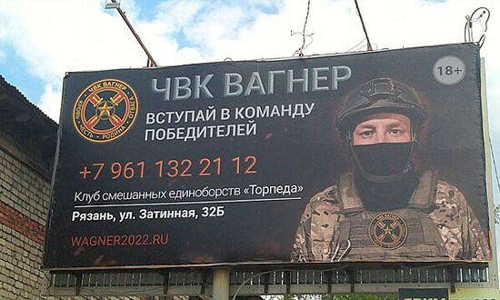

# Desafio proposto

- Para testar as capacidades da IA generativa, foram utilizadas 2 fotos aleatórias de lugares do mundo.
- Ao utilizar o Copilot da Microsoft, o intuito era que a IA identificasse o local em questão, alémd e traduzir conteudos especificos dispostos em placas e faixas apresentadas na imagem.

1. Para o primeiro teste, foi utilziado como exemplo a imagem abaixo, representando a entrada de Chinatown

- Pedi ao modelo generativo que traduzisse o conteudo do portal, além de descrever de qual local se trata. O resultado foi o seguinte:

> *O texto no portão diz “華埠”, que significa Chinatown em chinês. Este local é uma Chinatown, caracterizada pelo tradicional portão de arquitetura chinesa e várias placas em chinês. A imagem mostra uma rua movimentada em Chinatown à noite, iluminada por várias luzes. O portão é ornamentado com designs intrincados e cores vibrantes. Os edifícios ao lado da rua têm placas em inglês e chinês, indicando negócios como mercados e restaurantes. Carros estão visíveis na rua, alguns em movimento e outros estacionados. Pedestres caminham pelas calçadas. O céu está escuro, indicando que é noite. Este local é uma parte vibrante e culturalmente rica da cidade! 🏮🌃*

1. Para o segundo teste, peguei uma imagem aleatória de um outdoor russo, com muitos elementos que poderiam causar desfoque e confusão para a IA, e pedi para que a mesma traduzisse o conteúdo da placa. O resultado foi o seguinte:
   

> *O texto na imagem diz:
> ЧВК ВАГНЕР
> VSTUPAY V KOMANDU POBEDITELEY!
> +7 961 132 21 12
> Klub smeshannykh edinoborstv “Torpedo”
> Ryazan’, ul. Zatinnaia, 325
> WAGNER2022.RU
>
> Isso se traduz para o seguinte em português:
> ЧВК ВАГНЕР (CHVK WAGNER)
> Junte-se à equipe dos vencedores!
> +7 961 132 21 12
> Clube de artes marciais mistas “Torpedo”
> Ryazan, rua Zatinnaia, 325
> WAGNER2022.RU*

# Insights

- O copilot da Microsoft se provou estar em outro nivel de conhecimento, pois não apenas interage com o publico, mas fornece curiosidades, locais, dicas e até utiliza emogis para complementar suas respostas, o que le da um aspecto mais "humanizado".

# Links

- <https://aka.ms/ai900-bing-copilot>
- <https://aka.ms/ai900-azure-openai>
- <https://aka.ms/ai900-content-filters>
