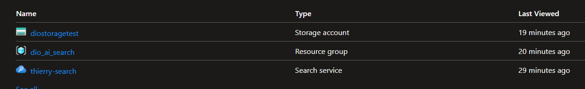

# Passo a passo para configuração ⚙️

- Acesse <https://portal.azure.com/#home>
- Na tela de recursos procure por "Azure AI Search"
- configurar o recurso, se atentando para marcar "Basic" na opção "Camada de preços"
- Retorne à página inicial do portal do Azure.
- Clique no botão "＋Criar um recurso" e pesquise "Azure AI services" > "Azure AI services multi-service account". Selecione criar um plano de serviços de IA do Azure. Você será levado a uma página para criar um recurso de serviços de IA do Azure.
- Retorne à página inicial do portal do Azure e selecione o botão + Criar um recurso. Procure o recurso de "storage account". Crie esse recurso também.
- o nome do recurso precisa ser único apenas com letras minusculas e numeros.
- na parte de Redundância, selecione "LRS (Local-Redundant Storage)"
- O serviço do storage account possui algumas regras de segurança por padrão. Por motivos de testes será necessário desabilitar ou alterar algumas delas:
  - Acesse a aba Settings > Configuration:
    - Allow Blob anonymous access = True
    - Save
- Acesse a aba Data Storage > Containers, crie um container. Perceba que na opção de "Anonymous access level", após habilitar a opção do passo anterior ficará disponivel uma opção "Container (anonymous read access for containers and blobs)".
- Selecione essa opção
- para o nome defina "coffeereviews";
- Após criado o container, é necessário carregar as reviews que utilizaremos para alimentar o modelo. Para isso, basta acessar a documentação disponivel na [última sessão](#faq)  deste manual; Outra opção é baixar as reviews do .zip disponivel neste diretório.

- Feito isso, selecione o container criado e, no menu superior selecione "upload" e então envie as reviews para o modelo, o alimentando.
- Até esse momento temos que ter 3 recursos:
  - um Recurso de Serviço de IA da Azure,
  - um recurso de Search Service
  - um recurso de Storage Account
  - 

- Acesse o recurso de Busca (Search Service)
- Clique em "Import Data"
- Será necessário estabelecer uma conexão com o recurso de "storage account".
- Na página Conectar-se aos seus dados, na lista Fonte de Dados, selecione "Azure Blob Storage". Preencha os detalhes do armazenamento de dados com os seguintes valores:
  - Fonte de dados: Armazenamento de Blobs do Azure
  - Nome da fonte de dados: coffee-customer-data
  - Dados a extrair: Conteúdo e metadados
  - Modo de análise: Padrão
  - Cadeia de conexão: *Selecione Escolha uma conexão existente. Selecione sua conta de armazenamento, selecione o contêiner de avaliações de café e clique em Selecionar.
  - Autenticação de identidade gerenciada: Nenhuma
  - Nome do contêiner: esta configuração é preenchida automaticamente depois que você escolhe uma conexão existente.
  - Pasta Blob: deixe em branco.
  - Descrição: Avaliações sobre Fourth Coffee Shops.
  -
- Selecione "Next: Add cognitive skills (Optional)".
- Na secção Anexar Serviços Cognitivos, selecione o seu recurso de serviços Azure AI.
- Na seção Adicionar enriquecimentos:
  - Altere o nome da Skillset para "coffee-skillset".
  - Marque a caixa de seleção "Habilitar OCR e mesclar todo o texto no campo merged_content"
  - Certifique-se de que o campo "Source Data Field" esteja definido como "merged_content".
  - Altere o nível de granularidade de enriquecimento para "Páginas (blocos de 5.000 caracteres)".
  - Não selecione "Enable incremental enrichment"


- Em Salvar enriquecimentos em um armazenamento de conhecimento, selecione:
  - Projeções de imagem
  - Documentos
  - Páginas
  - Frases chave
  - Entidades
  - Detalhes da imagem
  - Referências de imagem
  
**Se aparecer um aviso solicitando uma cadeia de conexão de conta de armazenamento:**

- Selecione Escolha uma conexão existente.
- Escolha a conta de armazenamento que você criou anteriormente.
- Clique em + Container para criar um novo contêiner chamado armazenamento de conhecimento com o nível de privacidade definido como Privado e selecione Criar.
- Selecione o contêiner de armazenamento de conhecimento e clique em Selecionar na parte inferior da tela.

- Selecione projeções de " Azure blob projections: Document". Uma configuração para o nome do contêiner com as exibições preenchidas automaticamente do contêiner de armazenamento de conhecimento. Não altere o nome do contêiner.
- Selecione "Next: Customize target index". Altere o nome do índice para "coffee-index".
- Certifique-se de que a "key" esteja definida como "metadata_storage_path". Deixe o "Suggester name" em branco e o "Search mode" preenchido automaticamente.
- Revise as configurações padrão dos campos de índice. Selecione "filtrável" para todos os campos que já estão selecionados por padrão.
- Selecione "Next: Create an indexer".
- Altere o "Indexer name" para "coffee-indexer".
- Deixe a programação definida como "once".
- Expanda as opções avançadas. Certifique-se de que a opção "Base-64 Encode Keys" esteja selecionada, pois as chaves de codificação podem tornar o índice mais eficiente.
- Selecione "Submit " para criar a fonte de dados, o conjunto de habilidades, o índice e o indexador. O indexador é executado automaticamente e executa o pipeline de indexação, que:
  - Extrai os campos de metadados do documento e o conteúdo da fonte de dados.
  - Executa o conjunto de habilidades cognitivas para gerar campos mais enriquecidos.
  - Mapeia os campos extraídos para o índice.
  
- Volte à página de recursos do "Azure AI Search".
- No painel esquerdo, em Gerenciamento de pesquisa, selecione "Indexers".
- Selecione o indexador de café recém-criado. Espere um minuto e selecione "Refresh" até que o Status indique sucesso.
- Selecione o nome do indexador para ver mais detalhes.
- Feito isso acesse a aba "Search Explorer" dentro do recurso de IA Search. (É como se tivessemos um diretório no servidor e uma aplicação que fica consultando esse diretório através do recurso de busca).
- O mecanismo de pesquisa esta dentro da azure, mas em um cenário real estaria dentro de uma aplicação.
- mude a visão para "Json view"
- perceba que o nosso indice criado aparece como referencia na campo "index";
- Digite no editor o conteudo abaixo, que retornará todos os documentos no indice de busca, incluindo todos os documentos no campo "@odata.count":

```
{
  "search": "*",
  "count": true
}
```

é possivel alterar o filtro por cidade (deverá tarzer 3 no @odata.count):

```
{
 "search": "locations:'Chicago'",
 "count": true
}
```

# Testes realizados e situação problema 🧭

- A situação problema utilizada para esse teste envolvia um Serviço de cafeteria que precisava levantar nformações sobre vendas, consumo e sobre a visão da marca em relação aos clientes.
- A situação nos mostra diferentes avaliações em relação aos serviços prestados pelo Café, sendo possivel retirar dados com base em chave-valor, atarvés d epalavras em um contexto semantico ou atraves do sentimento expressado por uma frase como um todo.

# Insights 💡

- A ferramenta é poderosa  e nos da inumeras possibilidades para levantamento de dados e analises estrategica em relação as reviws recebidas. Porem poeriam ser quaisquer tipos de dados, sejam dados de investimento para definir perfis de investimento ou ate mesmo analise por região para saber onde um produto se comporta melhor em vendas.

## FAQ📚

- <https://aka.ms/ai900-ai-search>
